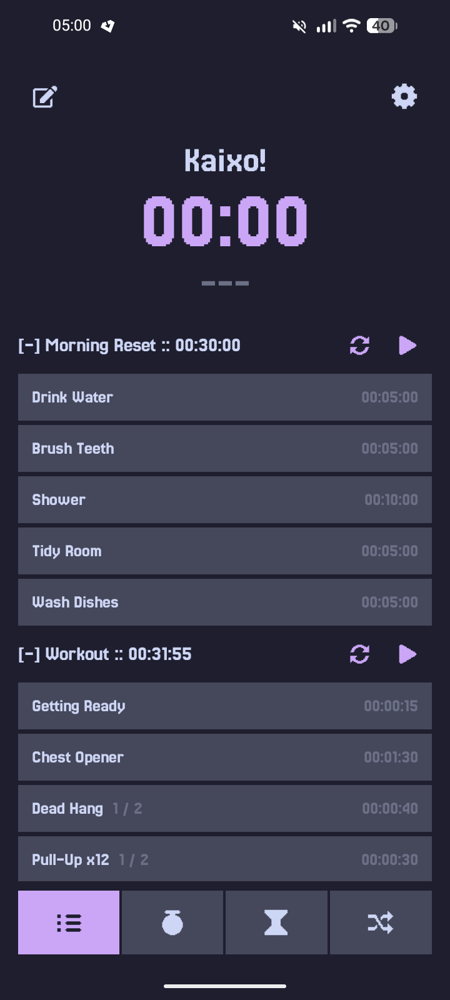
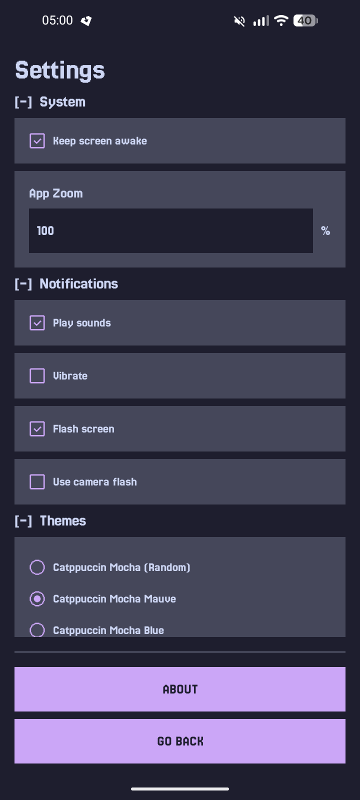
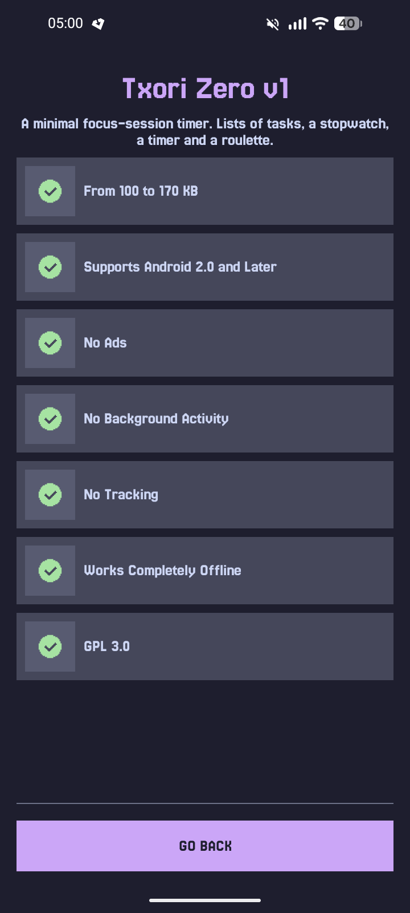

# Txori Zero

**A minimal focus-session timer. Lists of tasks, a stopwatch, a timer and a roulette.**

| Home | Settings | About |
| - | - | - |
|  |  |  |

Designed to support Android API 5 (Android 2.0) through the latest Android versions, with a focus on broad compatibility and long-term stability.

---

## Features

- **Lists**: tap play on a list header to run its tasks one after another (with optional rest). Pencil icon edits lists, tasks and order.
- **Stopwatch / Timer**: tap to start or pause, long-press to reset. Pencil icon sets the timer (HHMMSS).
- **Roulette**: shuffles a list and gives every task the same timer.
- **Settings**: keep screen awake, zoom, notifications (sound, vibration, screen flash, camera flash on API 23+), themes, backup export/import (API 19+).

---

## Installation

  
  &nbsp;
  

